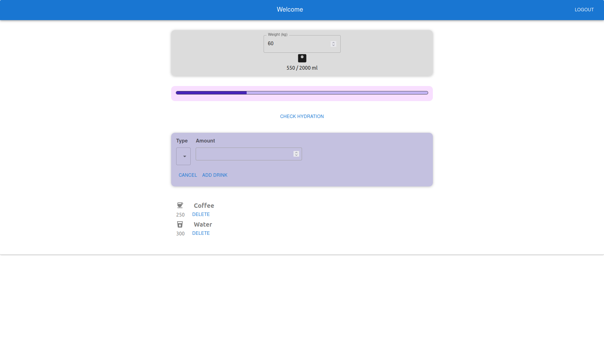

# waterReminder - React app for tracking soft drinks daily 

This is the very first of my React projects, both designed and implemented.

## The functionalities

Users should be able to:

- Log in to the app
- Add and remove drinks from his/her list of a day
- Choose drink type and see warning regarding daily recommended coffe amount
- See his/her recommended hydration level based on provided weight in kgs on a chart 

## Built with

- Semantic HTML5 markup
- CSS custom properties
- Flexbox
- [React](https://reactjs.org/) - JS library (v 14.17.0)
- Material UI library

## What I learned

- keeping values in context is often better than passing them via props chains - even in small apps 
- useReducer() is an elegant but challenging solution for keeping track of a state; the game is not always worth the candle!

## How it looks like

Nothing fancy but all mine!

